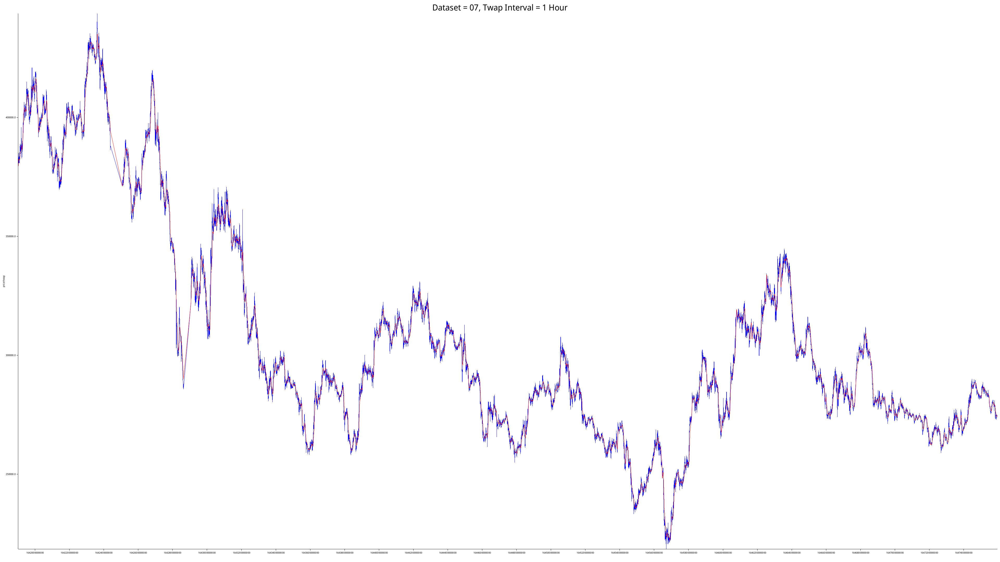

# Drift's historical data

This data analysis was made to ensure the time weighted average price is computed correctly for Escher's Virtual Automated Market Maker.

Below are some `gifs` for each of the 13 available markets in the period 04/12/21 to 18/03/22.

 
 
 
 
 
 
 
 
 
 
 
 
 
